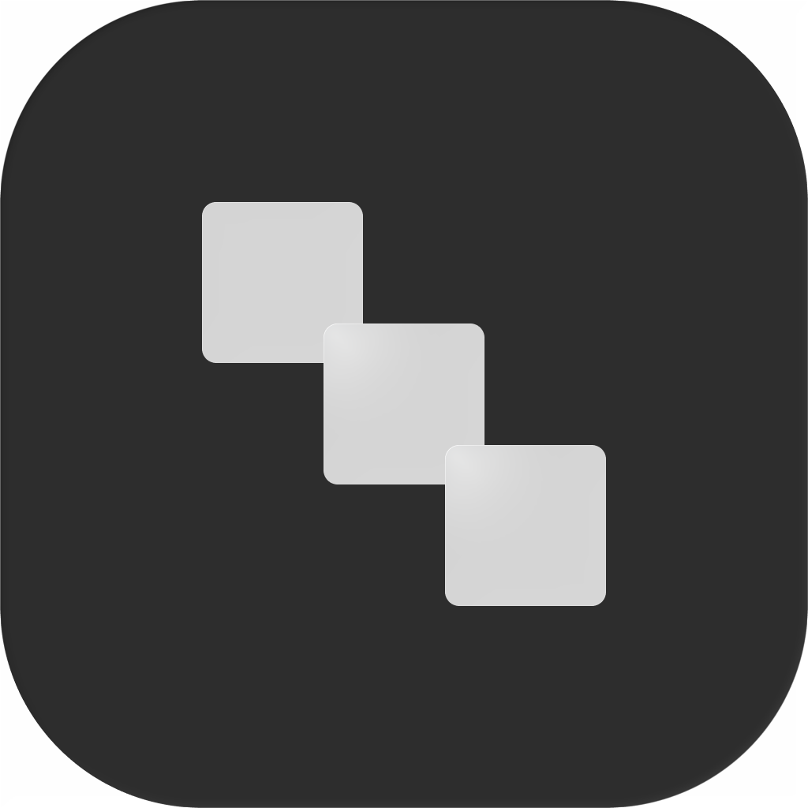

<p align="center">
  
</p>

<h1 align="center">PolyUI</h1>

<p align="center">
  A clean desktop client for local models, cloud providers, and coding agents.
</p>

<p align="center">
  <a href="https://github.com/monolabsdev/poly-ui/releases/latest">
    
  </a>
  <a href="https://github.com/monolabsdev/poly-ui/releases">
    
  </a>
  <a href="https://github.com/monolabsdev/poly-ui/stargazers">
    
  </a>
  <a href="LICENSE">
    
  </a>
</p>

<p align="center">
  <a href="https://github.com/monolabsdev/poly-ui/releases/latest">Download</a>
  ·
  <a href="https://linear.app/poly-ui/view/roadmap-fa502b4506c7">Roadmap</a>
  ·
  <a href="https://github.com/monolabsdev/poly-ui/issues">Issues</a>
  ·
  <a href="https://ko-fi.com/F8O123TMDU">Support</a>
</p>

<p align="center">
  
</p>

PolyUI brings local models, bring-your-own-key cloud providers, and local coding agents into one focused desktop application.

Use fully local models through Ollama, connect hosted providers when needed, or work with Claude Code and Codex using their existing command-line logins. PolyUI keeps conversations and application data on your device while giving you explicit control over providers and tools that communicate externally.

## Highlights

* **Local and hosted models** — Connect Ollama, OpenAI, Anthropic, Google Gemini, OpenRouter, LM Studio, Vercel AI Gateway, or another OpenAI-compatible server.
* **Claude Code and Codex** — Run coding sessions against a local workspace using your existing CLI authentication.
* **Private by default** — Conversations remain in PolyUI's local SQLite database, while provider credentials are stored in the operating system keychain.
* **Parallel conversations** — Stream responses from multiple models independently without blocking the rest of the application.
* **Integrated tools** — Use web search and an optional terminal tool with visible activity and structured results.
* **Controlled agent access** — Coding sessions begin in read-only mode. File and command mutations require an editable workspace mode and explicit approval.
* **Rich responses** — Render Markdown, syntax-highlighted code, tables, citations, reasoning, and LaTeX through KaTeX.
* **Native desktop packaging** — Available for Windows, macOS, and Linux without requiring Docker, Kubernetes, or a browser-hosted interface.

> [!IMPORTANT]
> PolyUI can run fully offline when connected to Ollama or another local model server. Hosted providers, web search, and other network-backed features require an internet connection and send requests to the service you configure.

## Install

Download the latest version from [GitHub Releases](https://github.com/monolabsdev/poly-ui/releases/latest).

| Platform                  | Package                    |
| ------------------------- | -------------------------- |
| macOS                     | Apple Silicon `.dmg`       |
| Windows                   | x64 setup `.exe` or `.msi` |
| Debian and Ubuntu         | x64 or arm64 `.deb`        |
| Fedora, RHEL and openSUSE | x64 or arm64 `.rpm`        |

Use `x64` for most Intel and AMD computers. Use `arm64` for ARM-based Linux devices and Apple Silicon Macs.

### Command-line installation

Linux and macOS:

```bash
curl -fsSL https://raw.githubusercontent.com/monolabsdev/poly-ui/main/scripts/install.sh | sh
```

Windows PowerShell:

```powershell
irm https://raw.githubusercontent.com/monolabsdev/poly-ui/main/scripts/install.ps1 | iex
```

These scripts detect your operating system and architecture, download the matching package from the latest GitHub release, and run the appropriate installer.

> [!NOTE]
> Ollama is optional. Install it only when you want to run local Ollama models.

> [!NOTE]
> AppImage packages are temporarily unavailable because the current Bun sidecar executable is incompatible with the AppImage `linuxdeploy` packaging process. Use the `.deb` or `.rpm` package on Linux.

## Development

### Requirements

Before building PolyUI, install:

* [Git](https://git-scm.com/)
* [Bun](https://bun.sh/) 1.3.14
* The Rust toolchain
* The [Tauri 2 system prerequisites](https://v2.tauri.app/start/prerequisites/) for your operating system

### Run locally

```bash
git clone https://github.com/monolabsdev/poly-ui.git
cd poly-ui

bun install
bun run sidecar:build
bun run tauri dev
```

The `main` branch contains the current stable source. To inspect unreleased development work:

```bash
git switch dev
```

> [!WARNING]
> The `dev` branch may contain unfinished features, incomplete migrations, or breaking changes.

### Test

```bash
bun run test
bun run sidecar:typecheck
bun run sidecar:test
```

### Build

Build the standard production packages:

```bash
bun run tauri build
```

Build the Windows installer that also sets up Ollama:

```bash
bun run ollama-setup
```

Production builds compile PolyUI's pinned AI SDK runtime into a target-specific Bun sidecar before Tauri creates the application package.

## Architecture

PolyUI uses React and Tauri for its desktop interface, Rust for native application services and credential handling, and a private Bun sidecar for the Vercel AI SDK runtime.

The sidecar communicates with the Rust host through its standard input and output. It does not expose a local HTTP server or open a loopback port.

Provider secrets are retrieved from the operating system keychain for individual requests. They are not stored in frontend state, browser storage, conversation records, URLs, or sidecar logs.

See [AI SDK runtime architecture](docs/ai-sdk-runtime.md) for provider support, security boundaries, coding-agent permissions, packaging details, and runtime version pins.

## Frequently asked questions

### Is Ollama required?

No. Ollama is only required for Ollama-hosted local models. PolyUI can also connect directly to supported cloud providers, AI Gateway, LM Studio, and custom OpenAI-compatible servers.

### Can PolyUI run completely offline?

Yes, when you use a local model server and avoid network-backed tools. Cloud providers and web search require an internet connection.

### How is PolyUI different from Open WebUI?

PolyUI is a packaged desktop application focused on a lightweight, native-feeling experience. It does not require you to operate a Python service, Docker container, or Kubernetes deployment.

### How do Claude Code and Codex work?

PolyUI uses the locally installed Claude Code and Codex command-line tools together with their existing login state. Coding sessions operate inside a workspace you select and begin with read-only access.

## Contributing

Bug reports, focused pull requests, documentation improvements, and tested fixes are welcome.

Before making a substantial architectural or product change, open an [issue](https://github.com/monolabsdev/poly-ui/issues) describing the problem and proposed approach.

When submitting code:

1. Keep changes focused.
2. Add or update relevant tests.
3. Verify the frontend, Rust application, and AI sidecar where applicable.
4. Explain user-visible behaviour and security implications in the pull request.

## Roadmap

Current work and planned features are tracked on the [public PolyUI roadmap](https://linear.app/poly-ui/view/roadmap-fa502b4506c7).

## Support

Support continued development through [Ko-fi](https://ko-fi.com/F8O123TMDU).

## License

PolyUI is available under the [MIT License](LICENSE).

Copyright © 2026 Theo Slater.
